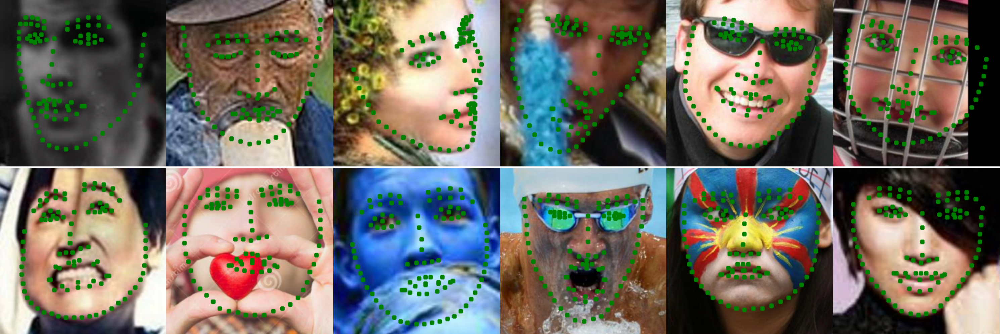
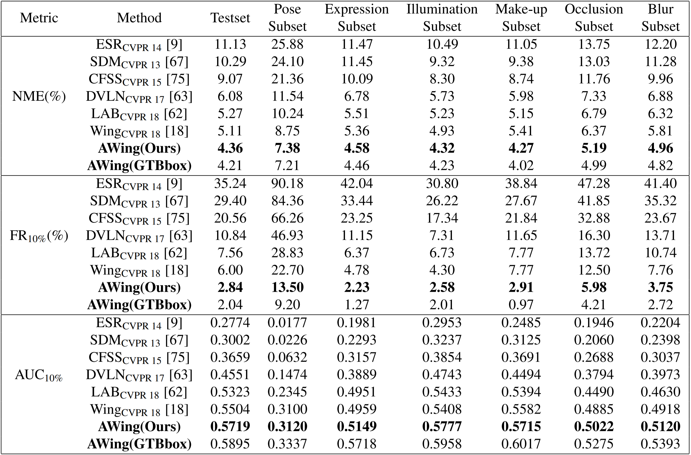

# AdaptiveWingLoss
## [arXiv](https://arxiv.org/abs/1904.07399)
Pytorch Implementation of Adaptive Wing Loss for Robust Face Alignment via Heatmap Regression.



## Update Logs:
### October 28, 2019
* Pretrained Model and evaluation code on WFLW dataset is released.

## Installation
#### Note: Code was originally developed under Python2.X and Pytorch 0.4. This released version was revisioned from original code and was tested on Python3.5.7 and Pytorch 1.3.0.

Install system requirements:
```
sudo apt-get install python3-dev python3-pip python3-tk libglib2.0-0
```

Install python dependencies:
```
pip3 install -r requirements.txt
```

## Run Evaluation on WFLW dataset
1. Download and process WFLW dataset
    * Download WFLW dataset and annotation from [Here](https://wywu.github.io/projects/LAB/WFLW.html).
    * Unzip WFLW dataset and annotations and move files into ```./dataset``` directory. Your directory should look like this:
        ```
        AdaptiveWingLoss
        └───dataset
           │
           └───WFLW_annotations
           │   └───list_98pt_rect_attr_train_test
           │   │
           │   └───list_98pt_test
           │
           └───WFLW_images
               └───0--Parade
               │
               └───...
        ```
    * Inside ```./dataset``` directory, run:
        ```
        python convert_WFLW.py
        ```
        A new directory ```./dataset/WFLW_test``` should be generated with 2500 processed testing images and corresponding landmarks.

2. Download pretrained model from [Google Drive](https://drive.google.com/file/d/1HZaSjLoorQ4QCEx7PRTxOmg0bBPYSqhH/view?usp=sharing) and put it in ```./ckpt``` directory.

3. Within ```./Scripts``` directory, run following command:
    ```
    sh eval_wflw.sh
    ```
    
    
    *GTBbox indicates the ground truth landmarks are used as bounding box to crop faces.

## Future Plans
- [x] Release evaluation code and pretrained model on WFLW dataset.

- [ ] Release training code on WFLW dataset.
 
- [ ] Release pretrained model and code on 300W, AFLW and COFW dataset.

- [ ] Replease facial landmark detection API


## Citation
If you find this useful for your research, please cite the following paper.

```
@InProceedings{Wang_2019_ICCV,
author = {Wang, Xinyao and Bo, Liefeng and Fuxin, Li},
title = {Adaptive Wing Loss for Robust Face Alignment via Heatmap Regression},
booktitle = {The IEEE International Conference on Computer Vision (ICCV)},
month = {October},
year = {2019}
}
```

## Acknowledgments
This repository borrows or partially modifies hourglass model and data processing code from [face alignment](https://github.com/1adrianb/face-alignment) and [pose-hg-train](https://github.com/princeton-vl/pose-hg-train).
